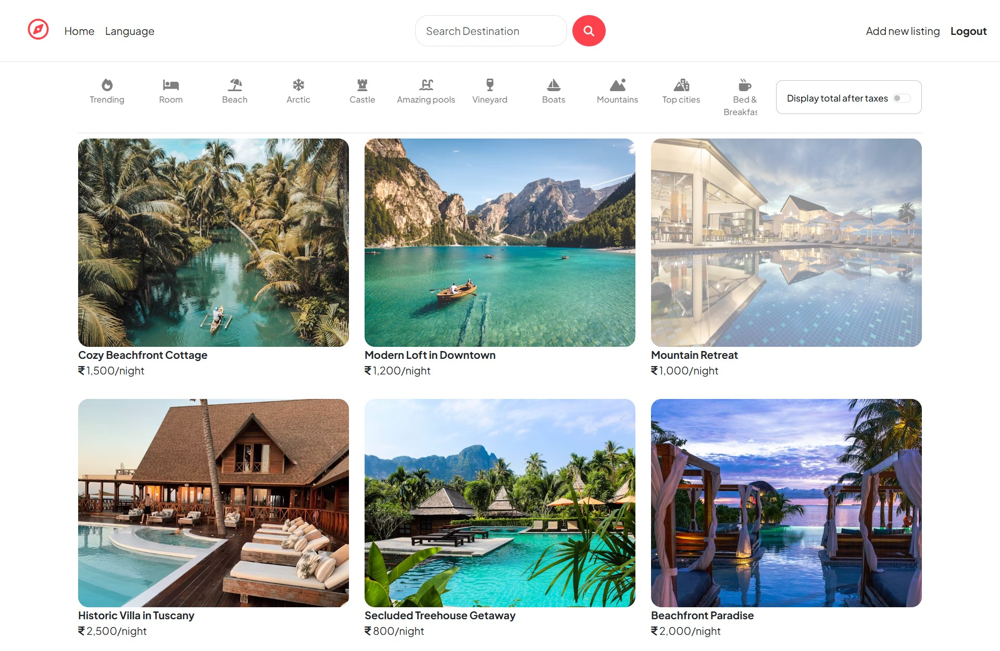
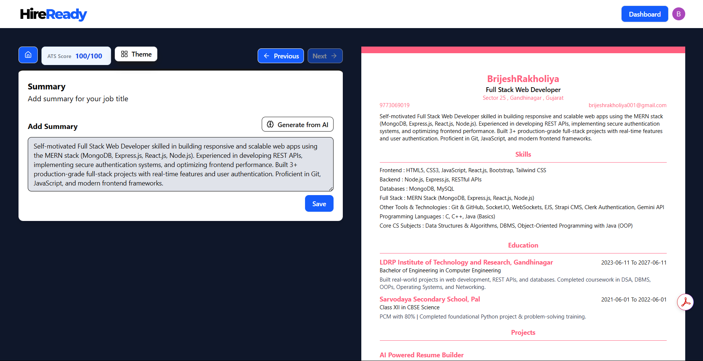

<!-- ═══════════════════════════════════════════════════════════════ -->
<!--                  BRIJESH RAKHOLIYA — GitHub Profile README                -->
<!-- ═══════════════════════════════════════════════════════════════ -->

<!-- ▓▓▓  ANIMATED HEADER BANNER  ▓▓▓ -->
<div align="center">


</div>

<!-- ▓▓▓  PROFILE PHOTO + TYPING ANIMATION  ▓▓▓ -->
<br/>


<div>

### 👋 Hey there, I'm Brijesh!

<a href="https://readme-typing-svg.demolab.com?font=Fira+Code&weight=500&size=20&pause=1000&color=7C3AED&width=480&lines=Full+Stack+Web+Developer+%F0%9F%9A%80;MERN+Stack+%7C+REST+APIs+%7C+Socket.IO;AI+Integration+%7C+Gemini+API;Building+Scalable+%26+Real-time+Apps;Open+to+Internship+Opportunities+%F0%9F%8C%9F" target="_blank">
  
</a>

<br/>

🎓 &nbsp;**Computer Engineering** @ LDRP Institute of Technology, Gandhinagar *(CGPA: 8.16)*  
🏗️ &nbsp;Built **3+ production-grade full-stack projects** with real users & live deployments  
🤖 &nbsp;Passionate about **AI-integrated web apps** using Gemini API  
⚡ &nbsp;Currently exploring **DevOps** — Docker · Kubernetes · GitHub Actions  
📬 &nbsp;Reach me at **brijeshrakholiya001@gmail.com**

</div>

<br clear="both"/>

<!-- ▓▓▓  ANIMATED DIVIDER  ▓▓▓ -->


<!-- ▓▓▓  CONNECT BADGES  ▓▓▓ -->
<div align="center">

[](https://www.linkedin.com/in/brijeshrakholiya17)
[](https://brijeshrakholiya17.github.io/Brijesh-portfolio-website/)
[](mailto:brijeshrakholiya001@gmail.com)
[](https://github.com/brijeshrakholiya17)
[](https://leetcode.com/)


</div>

<br/>

<!-- ▓▓▓  ABOUT ME  ▓▓▓ -->
## 🧑‍💻 About Me

```javascript
const brijesh = {
  role        : "Full Stack Web Developer",
  stack       : ["MongoDB", "Express.js", "React.js", "Node.js"],
  currentFocus: ["DevOps Pipelines", "MLOps", "AI-integrated Web Apps"],
  openTo      : "Full Stack / Web Dev Internships",
  funFact     : "I built a real-time quiz app that handles 50+ concurrent users with <100ms latency 🎯"
};
```

<!-- ▓▓▓  ANIMATED DIVIDER  ▓▓▓ -->


<!-- ▓▓▓  TECH STACK  ▓▓▓ -->
## 🛠️ Tech Stack & Tools

<div align="center">

<!-- ── FRONTEND ── -->
<table>
  <thead>
    <tr>
      <th colspan="6" align="center">
        
      </th>
    </tr>
  </thead>
  <tbody>
    <tr>
      <td align="center" width="108">
        <br/>
        <sub><b>HTML5</b></sub>
      </td>
      <td align="center" width="108">
        <br/>
        <sub><b>CSS3</b></sub>
      </td>
      <td align="center" width="108">
        <br/>
        <sub><b>JavaScript</b></sub>
      </td>
      <td align="center" width="108">
        <br/>
        <sub><b>React.js</b></sub>
      </td>
      <td align="center" width="108">
        <br/>
        <sub><b>Tailwind CSS</b></sub>
      </td>
      <td align="center" width="108">
        <br/>
        <sub><b>Bootstrap</b></sub>
      </td>
    </tr>
  </tbody>
</table>

<br/>

<!-- ── BACKEND & DATABASE ── -->
<table>
  <thead>
    <tr>
      <th colspan="5" align="center">
        
      </th>
    </tr>
  </thead>
  <tbody>
    <tr>
      <td align="center" width="108">
        <br/>
        <sub><b>Node.js</b></sub>
      </td>
      <td align="center" width="108">
        <br/>
        <sub><b>Express.js</b></sub>
      </td>
      <td align="center" width="108">
        <br/>
        <sub><b>MongoDB</b></sub>
      </td>
      <td align="center" width="108">
        <br/>
        <sub><b>MySQL</b></sub>
      </td>
      <td align="center" width="108">
        <br/>
        <sub><b>Socket.IO</b></sub>
      </td>
    </tr>
  </tbody>
</table>

<br/>

<!-- ── TOOLS, AI & PLATFORMS ── -->
<table>
  <thead>
    <tr>
      <th colspan="6" align="center">
        
      </th>
    </tr>
  </thead>
  <tbody>
    <tr>
      <td align="center" width="108">
        <br/>
        <sub><b>Git</b></sub>
      </td>
      <td align="center" width="108">
        <br/>
        <sub><b>GitHub</b></sub>
      </td>
      <td align="center" width="108">
        <br/>
        <sub><b>Docker</b></sub>
      </td>
      <td align="center" width="108">
        <br/>
        <sub><b>Gemini API</b></sub>
      </td>
      <td align="center" width="108">
        <br/>
        <sub><b>Clerk Auth</b></sub>
      </td>
      <td align="center" width="108">
        <br/>
        <sub><b>Strapi CMS</b></sub>
      </td>
    </tr>
  </tbody>
</table>

<br/>

<!-- ── LANGUAGES ── -->
<table>
  <thead>
    <tr>
      <th colspan="3" align="center">
        
      </th>
    </tr>
  </thead>
  <tbody>
    <tr>
      <td align="center" width="108">
        <br/>
        <sub><b>C / C++</b></sub>
      </td>
      <td align="center" width="108">
        <br/>
        <sub><b>Java</b></sub>
      </td>
      <td align="center" width="108">
        <br/>
        <sub><b>Python</b></sub>
      </td>
    </tr>
  </tbody>
</table>

</div>

<!-- ▓▓▓  ANIMATED DIVIDER  ▓▓▓ -->


<!-- ▓▓▓  FEATURED PROJECTS  ▓▓▓ -->
## 🚀 Featured Projects

---

### 🌍 WanderStay — Global Home-Sharing & Rental Platform

<div align="center">
<a href="https://wanderstay-project-jcnv.onrender.com" target="_blank">
  
</a>
</div>

<br/>

> An Airbnb-inspired rental platform — built end-to-end on the **MERN stack**

| 🔑 Highlights | |
|---|---|
| 🗂️ **Stack** | MongoDB · Express.js · React.js · Node.js · Tailwind CSS · Bootstrap |
| 👥 **Scale** | Handles **100+ simulated users** with property search, booking & auth |
| ⚡ **Performance** | RESTful APIs with MongoDB indexing cut response time by **40%** |
| 🔐 **Auth** | Secure authentication system integrated |

[](https://wanderstay-project-jcnv.onrender.com)
[](https://github.com/brijeshrakholiya17)

---

### 🤖 AI-Powered Resume Builder — HireReady

<div align="center">
<a href="https://github.com/brijeshrakholiya17/ai-resume-builder-project" target="_blank">
  
</a>
</div>

<br/>

> AI-integrated resume builder that auto-generates content, scores ATS compatibility, and exports to PDF

| 🔑 Highlights | |
|---|---|
| 🗂️ **Stack** | MERN · Gemini API · Clerk Auth · Strapi CMS |
| 🤖 **AI** | Gemini API generates resume content — saves **70% manual effort** |
| 🔐 **Auth** | Clerk authentication + form validation (min. 2 projects & 2 experiences) |
| 📄 **Export** | PDF export with ATS score tracking |

[](https://github.com/brijeshrakholiya17/ai-resume-builder-project)

---

### 🎮 QuizFight — Real-Time Multiplayer Quiz Platform

> High-performance real-time quiz battle app built with **Socket.IO**

| 🔑 Highlights | |
|---|---|
| 🗂️ **Stack** | Node.js · Express.js · Socket.IO · WebSockets |
| 👥 **Scale** | Supports **50+ concurrent users** with live leaderboards |
| ⚡ **Latency** | WebSocket architecture ensuring **< 100ms** for seamless gameplay |

<!-- ▓▓▓  ANIMATED DIVIDER  ▓▓▓ -->


<!-- ▓▓▓  EXPERIENCE & CERTIFICATIONS  ▓▓▓ -->
## 🏆 Experience & Certifications

| 🏢 | Role | Organization | Period |
|---|---|---|---|
| 💼 | **Front-End Web Dev Intern** | AICTE & Edunet Foundation | Aug 2025 |

| 📜 | Certification | Issuer | Year |
|---|---|---|---|
| 🎓 | Full Stack Web Development — Delta 3.0 | Apna College | March 2024 |
| 🎓 | Python for Data Science (4-Week) | NPTEL | July 2025 |

<!-- ▓▓▓  ANIMATED DIVIDER  ▓▓▓ -->


<!-- ▓▓▓  CURRENTLY BUILDING  ▓▓▓ -->
## 🔭 Currently Building

```
🐳  DevOps Pipelines     →  Docker · Kubernetes · Terraform
⚙️  CI/CD Automation     →  GitHub Actions
🤖  MLOps Infrastructure →  Productionising MERN + AI apps
```

<!-- ▓▓▓  CONTRIBUTION SNAKE  ▓▓▓ -->
## 🐍 Contribution Activity

<div align="center">

<picture>
  <source media="(prefers-color-scheme: dark)"  srcset="https://raw.githubusercontent.com/brijeshrakholiya17/brijeshrakholiya17/output/github-contribution-grid-snake-dark.svg"/>
  <source media="(prefers-color-scheme: light)" srcset="https://raw.githubusercontent.com/brijeshrakholiya17/brijeshrakholiya17/output/github-contribution-grid-snake.svg"/>
  
</picture>

</div>

<!-- ▓▓▓  FOOTER WAVE  ▓▓▓ -->
<br/>


<div align="center">

*⭐ If any of my projects helped you, consider leaving a star — it means the world!*

</div>
